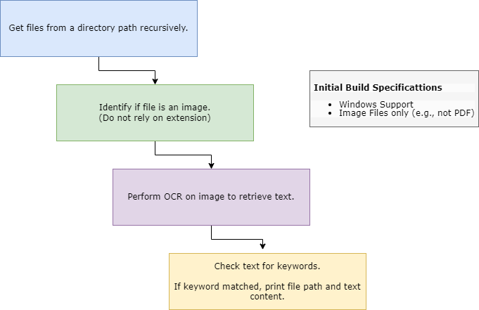

# Module 01 - Image Content Analyzer

## What?

image_analyzer.py is a Python script which will query images within a given directory path for the presence of specified keywords.

## Why?

Image files do not contain queryable text and require manual analysis to review. Additionally, image files produced by various sources can have misleading or missing extensions. 

Discovery Use Cases
- [Offensive] Post-exploitation for sensitive content
- [Defensive] Data Loss Prevention
- [Defensive] Data Classification and Marking requirements

## How?

This script leverages file magic bytes to identify images and OCR functionality to convert those images to text.



1. Scan directory path to identify files.
2. Identify file type based on extension and/or magic byte; Append to list if file is an image.
3. Perform OCR on files in the image list to produce companion text.
4. Query companion text for matches against a provided wordlist. Wordlist can contain keywords of interest based on use case (e.g. authentication token identifiers, regulated data markers, ...) 

## Future Improvements

- [ ] Include support for alternative OCR formats, such as PDF
- [ ] Better image differentiation (e.g., support for extension inclusions/exclusion lists, dictionary for magic response semantics,...)
- [ ] Copy identified matches to directory path for export
- [ ] Compile script with tesseract components bundled to run on target endpoints for remote analysis

## Install

### Windows Prerequisites

#### Install Tesseract
- download and run latest installer from https://digi.bib.uni-mannheim.de/tesseract/

#### Install Python Libraries
```
pip3 install -r requirements.txt
```

Library resources:
- `python-magic`: libmagic file identification library (ref: https://github.com/ahupp/python-magic)
- `pytesseract` : Python wrapper for Tesseract OCR utility (ref: https://github.com/madmaze/pytesseract)


### Linux Prerequisites (*not tested*)

#### Install Tesseract
- follow documentation available at https://tesseract-ocr.github.io/tessdoc/Installation.html

Ubuntu
```
sudo apt install tesseract-ocr
sudo apt install libtesseract-dev
```

#### Install Python Libraries
```
pip3 install -r requirements.txt
```

## Usage

help
```
usage: image_analyzer.py [-h] [-d DIRECTORY] [-f FILE]

image_analyzer.py is a Python script which will query images within a given directory path for the presence of specified keywords.

options:
  -h, --help            show this help message and exit
  -d DIRECTORY, --directory DIRECTORY
                        The directory path to scan.
                        Default value: [current directory]
  -f FILE, --file FILE  The path to the keyword list file.
                        The keyword list file should contain one term per line.
                        Default value: [./keywords.txt]

Thanks for trying image_analyzer!
```

## Demonstration

link to video here
