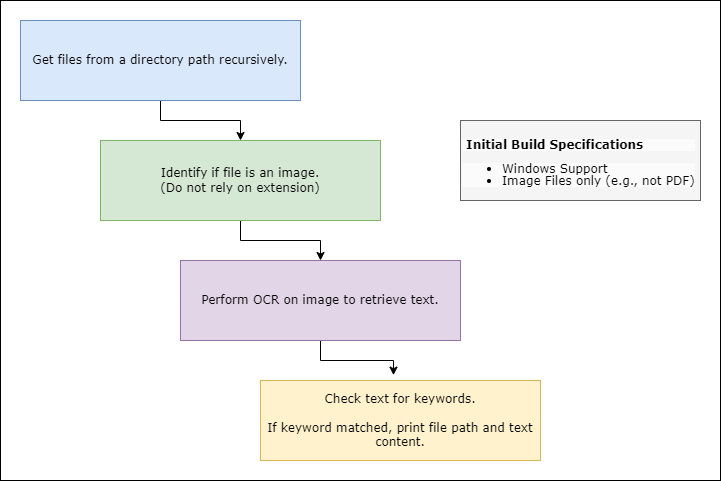

# Module 01 - Image Content Analyzer

## Why?

Image files do not contain queryable text; requires manual analysis to review

Discovery Use Cases
- [Offensive] Post-exploitation for sensitive content
- [Defensive] Data Loss Prevention
- [Defensive] Data Classification and Marking requirements

## How?



1. Scan directory path to identify files.
2. Identify file type based on extension and/or magic byte; Append to list if file is an image.
3. Perform OCR on files in the image list to produce companion text.
4. Query companion text for matches against a provided wordlist. Wordlist can contain keywords of interest based on use case (e.g. authentication token identifiers, regulated data markers, ...) 

## Future Improvements

- Include support for alternative OCR formats, such as PDF
- Better image differentiation (e.g., support for extension inclusions/exclusion lists, dictionary for magic response semantics,...)
- Copy identified matches to directory path for export
- Compile script with tesseract components bundled to run on target endpoints for remote analysis

## Install

Install Python Magic for file magic-byte identification
```
pip3 install python-magic
pip3 install python-magic-bin
```

Install Tesseract (Windows)
- download latest installer from https://digi.bib.uni-mannheim.de/tesseract/

```
pip3  install pytesseract
```

## Demonstration

link to video here
