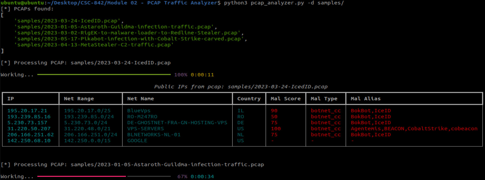

# Module 02 - PCAP Traffic Analyzer

## What?

pcap_analyzer.py is a script that will recurse through a provided directory to identify pcaps, extract unique public IPs, and provide security intelligence via a user-friendly graph output.

## Why?

This tool is meant to provide intelligence in available network packet data. The primary objectives are:
- To aid in external network traffic characterization IP enrichment
- To identify the presence of malicious connections within network traffic
- To enumerate specific malware attributes associated with malicious connections

The recursive pcap extraction may be useful where data is hosted on remote share (such as an Arkime or Zeek server) and folder contents hold more than just pcap files.

Anticipated users include:
- Security analysts for threat hunting activities
- DFIR professionals for incident response investigations
- Security and AppSec Engineers for traffic profiling

## How?

Script steps:
- Use `os.walk()` to retrieve a list of pcaps recursively from a directory
- Use Scapy's `rdpcap` function to parse source and destination IP address values and append to list for unique values
- Use IPy's `iptype()` function to identify public IP addresses
- Use RIR data to provide IP enrichment data. The script leverages the RIPE API, which is capable of retrieving other RIR data (ARIN, LACNIC, etc.)
- Use ThreatFox's API to identify and characterize malicious IPs
- Return enriched IP data to the user via a color-formated graph to aid in visual analysis

Data returned includes:
- Public IP Address
- Network Range of associated IP (RIPE data)
- Network name (RIPE data)
- Country of IP registration (RIPE data)
- A malware score based on Threatfox's confidence level (reference API documentation link below for details)
- Threatfox's malware type classification (e.g., `botnet_cc`, `payload_delivery`, ...)
- Threatfox's malware alias or common name (e.g., `Bokbot`, `CobaltStrike`, ...)

### API references
- [RIPE Whois API](https://stat.ripe.net/docs/02.data-api/whois.html)
- [Threatfox API](https://threatfox.abuse.ch/api)

## Future Improvements

- [ ] Include support for live data capture via Scapy (real-time monitoring). 
- [ ] Additional IP data enrichments (_Greynoise API function included, but not implemented as it relies on registration for key_)
- [ ] Add counters and directionality (source or destination)

## Install

```
pip3 install -r requirements.txt
```

## Usage


```
usage: pcap_analyzer.py [-h] [-d DIRECTORY]

pcap_analyzer.py is a script that will:
    * recurse through a provided directory to identify pcaps,
    * extract unique public IPs,
    * and provide security intelligence via a user-friendly graph output.

options:
  -h, --help            show this help message and exit
  -d DIRECTORY, --directory DIRECTORY
                        The directory path to scan for pcap files.
                        Default value: [current directory]

Thanks for trying pcap_analyzer!
```

## Demonstration



Sample pcaps from [malware-traffic-analysis.net](https://www.malware-traffic-analysis.net/2023/) are available within the `samples/` directory of this repository.


 ### Video: 

 - [Demo Video](https://youtu.be/_KTtNDVJ344)