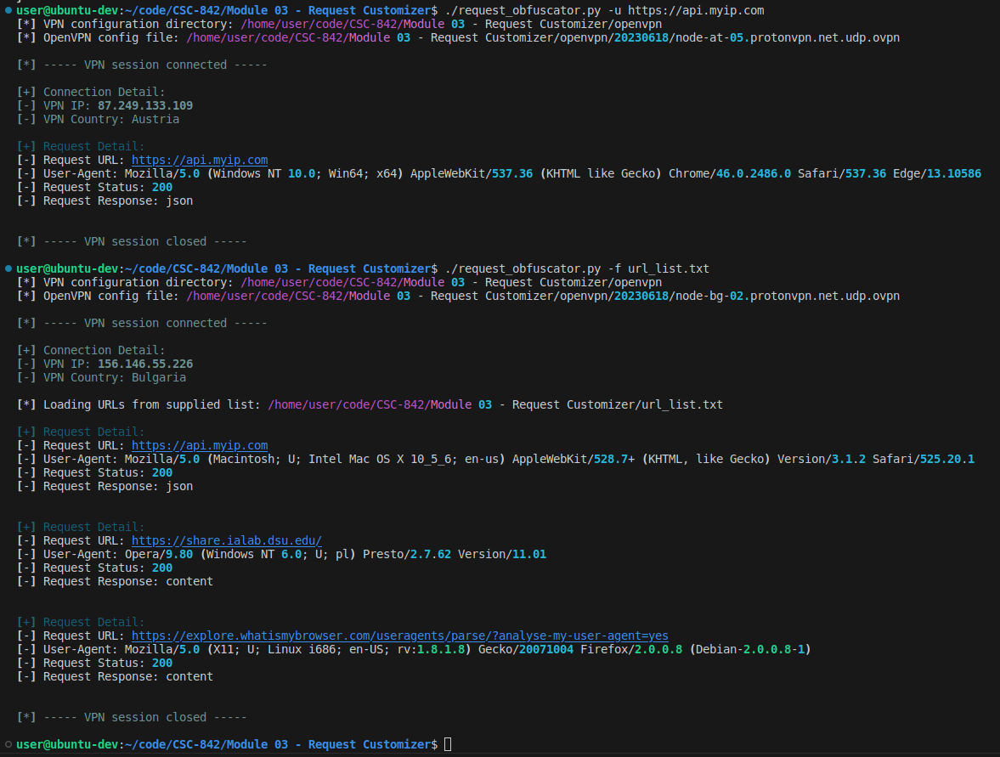
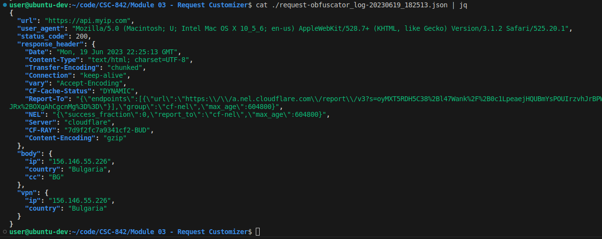

# Module 03 - Web Request Obfuscator

## What?

request_obfuscator.py attempts to obfuscate a web request to a specified URL or URL list.

The script will:
- Connect a VPN using the specified  configuration,
- Execute the web request using a modified header,
- Log the response along with request parameters,
- Exit the VPN session.


## Why?

Allows offensive security practioners to potentially evade security mechanisms, such as network and web application firewall IP blocks, geo-restrictions, and request header fields.

Allows defensive security practiioners to test and validate the same security mechanisms and controls.

## How?

The script begins by establishing a VPN connection.

The script either accepts a specified OpenVPN configuration file (`--config`) or will find configuration files from a specified directory (`--directory`) and connect to a random one.

Once the VPN is connected, all subsequent web requests are made through this connection. 

For the web request(s), the script accepts a URL (`--url`) or a URL list (`--file`) with a URL per line.

The web requests are made with a randomly generated user-agent to replace the default python requests library version. 

The details of the request are logged to a unique JSON file per request made. 

The following fields are included in the log:
- Request URL
- Request User-Agent used 
- Response status code
- Response header
- Response body (attempts json, if not available, logs content)
- VPN IP and Country used

Once the requests are made, the script kills the OpenVPN session

### API references
- myip.com is used to return the current IP address and country of the requestor's origin. 
- myip.com API documentation is here: [docs](https://www.myip.com/api-docs/)

## Future Improvements

- [ ] Include support for Wireguard and Tailscale VPNs
- [ ] Include additional header and request manipulation options, such as with scapy
- [ ] Improve response parser to handle various response formats (e.g., XML, HTML, ...)
- [ ] Improve request parameter options available (e.g., different ops such as POST or PUT, ...)
- [ ] Configure web proxy selection (limited access to proxy pool during initial build) 

## Install

### Python Dependencies
```
pip3 install -r requirements.txt
```

### Linux host configuration

The script requires sudo access to setup the VPN tunnel.

To prevent the need to input credentials, ensure the executing user has passwordless sudo access configured.

Typically, this can be accomplished by adding the following to the `/etc/sudoers` file:

```
user    ALL=(ALL) NOPASSWD:ALL
```


### OpenVPN configuration
An OpenVPN client will need to be installed. On Ubuntu, this can be accomplished with:
```
sudo apt-get install openvpn
```

The repo directory `./openvpn` is the default location to load configuration file(s).

In each OpenVPN configuration file, add the following parameter: `auth-user-pass login.conf`

If the available configuration files are loaded into the default repo directory, the following command can be used for find and replace:
```
find ./openvpn/ -type f -exec sed -i 's/auth-user-pass login.conf/auth-user-pass login.conf/g' {} +
```

The referenced `login.conf` should be in the root directory and store your VPN credentials as follows:

```
username
password
```


## Usage


```
usage: request_obfuscator.py [-h] (-u URL | -f FILE) [-c CONFIG] [--d D] [--debug | --no-debug]

request_obfuscator.py attempts to obfuscate a web request to a specified URL or URL list.

the script will:
    * connect a VPN using the specified configuration,
    * execute the web request using a modified header,
    * exit the VPN session.

options:
  -h, --help            show this help message and exit
  -u URL, --url URL     specify a URL to request.
                        [ note: either --url or --file is required] 
                            
  -f FILE, --file FILE  specify a file containing a list of URLs.
                        the file should contain a URL per line.
                        [ note: either --url or --file is required ]
                            
  -c CONFIG, --config CONFIG
                        specify an OpenVPN configuration file.
                        if option is not provided, will default to --directory option and default
                            
  --d D, --directory D  the directory path to check for OpenVPN configuration files.
                        default value: [./openvpn]
                            
  --debug, --no-debug   Enable debugging output to the console.
                         (default: False)

Reference source at https://github.com/jcole-sec/CSC-842/tree/main/Module%2003%20-%20Request%20Customizer
```

## Demonstration

Script in execution:



Sample log file:


### Video: 

 - [Demo Video](https://youtu.be/...)