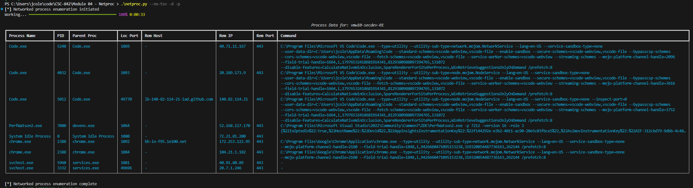

# Module 04 - NetProc (Windows Networked Process Enumerator)

## What?

Netproc is python-based tool used to identify network socket connections in use by Windows processes. 

It is meant to function similar to the Windows `netstat -naob` command or `lsof -i` on Linux with expanded enrichment and logging features.


## Why?

This tool is primarily intended for defensive and situational awareness purposes to enumerate what network activities are being executed by system processes.

Some example use cases include:
- Forensic review for rogue or unintended process identification
- Process network utilization for firewall allow-listing or network segmentation rule crafting
- Enumerating vulnerable or incompliant software based on process hash matching

## How?

Netproc makes use of the Python socket and psutil libraries to retrieve Windows process and network connection details.

Netproc captures the following data:
- Process name and id
- Parent process name and id
- Local and remote socket connection details, including IP and Port, attempted name resolution, and IP type (e.g., public, private, loopback, or linklocal)
- Process path and command line parameters used to execute it
- SHA-256 hash of the process binary

Netproc also provides the following options:
- Log file creation with tab-separate value (tsv) and/or JSON output formatting
- Display summarized data to the console with a formatted table output.
- Filter data output for processes with connections to or from public IPs.


## Future Improvements

- [ ] Include support for malicious detections or threat patterns leveraging collected data.
- [ ] Add option to export to JSON over TCP or Elasticsearch.
- [ ] Include additional enrichments for potential indicator attributes (IP WhoIS, Hash lookups, etc.)


## Install


### Install Python Libraries

Install for script only:
```
pip3 install -r requirements.txt
```

Install for executable build:
```
pip3 install -r requirements.txt
```


### Executable Build

The executable is compiled using PyInstaller, which can be installed via the pip requirements file above. 

The build process produces a [spec file](https://github.com/jcole-sec/CSC-842/blob/main/Module%2004%20-%20Netproc/netproc.spec) that can be used to tailor future builds to meet usage or tooling needs.


Build command:
```
pyinstaller.exe --onefile --icon=assets/Kyo-Tux-Delikate-Network.ico netproc.py
```
- _Note: the included icon under assets was retrieved from [icon archive](https://www.iconarchive.com/show/delikate-icons-by-kyo-tux/network-icon.html) and is marked restricted for personal use only_


## Usage

help
```
usage: netproc.py [-h] [-t | --tsv | --no-tsv] [-j | --json | --no-json] [-d | --display | --no-display] [-p | --public | --no-public] [--debug | --no-debug]

netproc is a tool that will:
    * Retrieve a list of all currently running processes
    * Display and/or log process details such as status, user, path, and parent process
    * Display and/or log network connection details related to each process


options:
  -h, --help            show this help message and exit
  -t, --tsv, --no-tsv   Enable output logging to tab-separate value (TSV) file.
                        File will be written to netproc_hostname_YYYYmmDD.HHMM.tsv

  -j, --json, --no-json
                        Enable output logging to a new-line delimited JSON file.
                        File will be written to netproc_hostname_YYYYmmDD.HHMM.json

  -d, --display, --no-display
                        Enable table display for process details.

  -p, --public, --no-public
                        Filter for processes with connections to or from public IPs.

  --debug, --no-debug   Enable additional console output for debugging purposes.


For support, contact https://github.com/jcole-sec.
```

## Demonstration

- Command with display output:
```
python .\netproc.py -d --no-tsv -p
```


Video:

- Video: https://youtu.be/3B3JWWuPkoU
